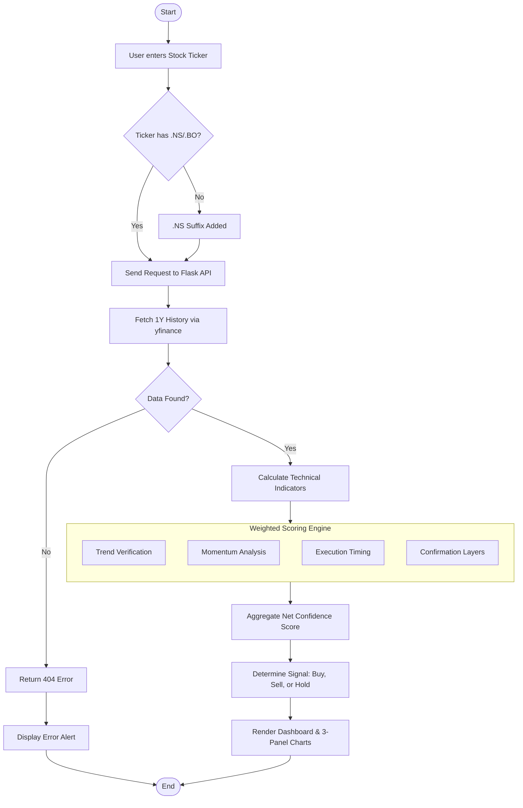
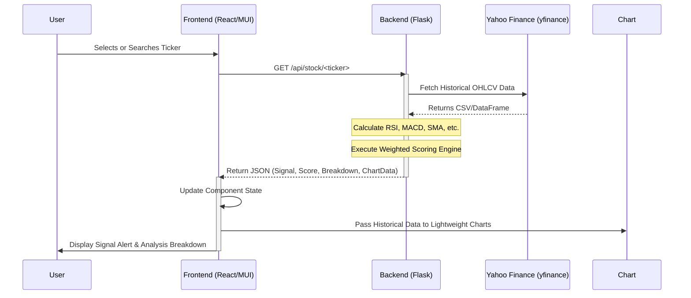

# QuantSense: System Architecture Diagrams

This document outlines the operational flow and logical interactions of the QuantSense Stock Tracking Tool using UML-standard Mermaid diagrams.

## 1. Activity Flow (Data Processing)
This flowchart illustrates the step-by-step logic from user input to the final signal generation.

---

## 2. Sequence Diagram (System Interaction)
This diagram shows the interaction between the User, React Frontend, Flask Backend, and External Data Sources.

---

## 3. Component Breakdown
- **User Interface**: React + MUI, handling user input and triggering API calls.
*   **Computation Layer**: Flask engine using `pandas` and `ta` for efficient vector-based calculations.
*   **Data Layer**: Integration with `yfinance` to bypass complex exchange API registrations.
*   **Visualization Layer**: Three independent but synchronized `lightweight-charts` instances.
